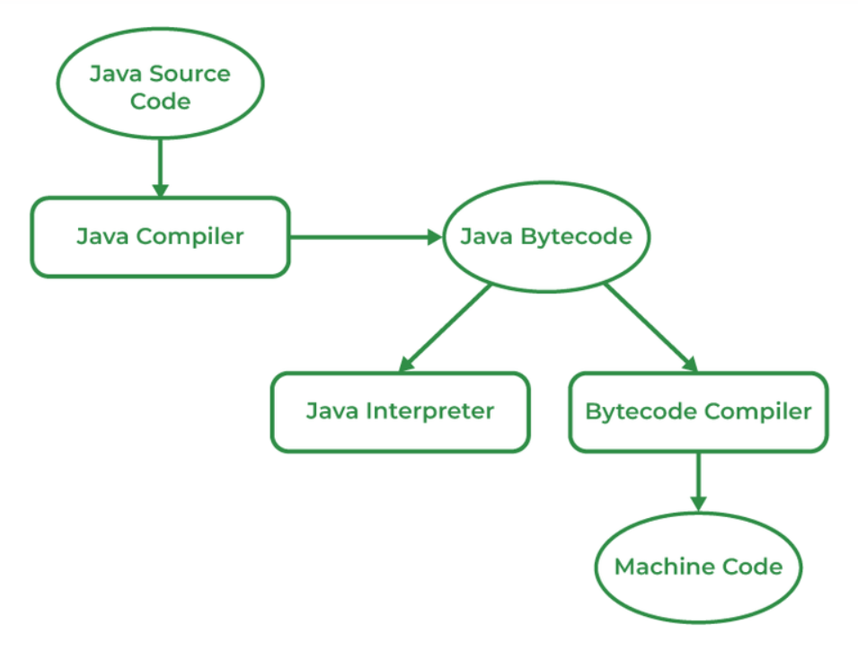
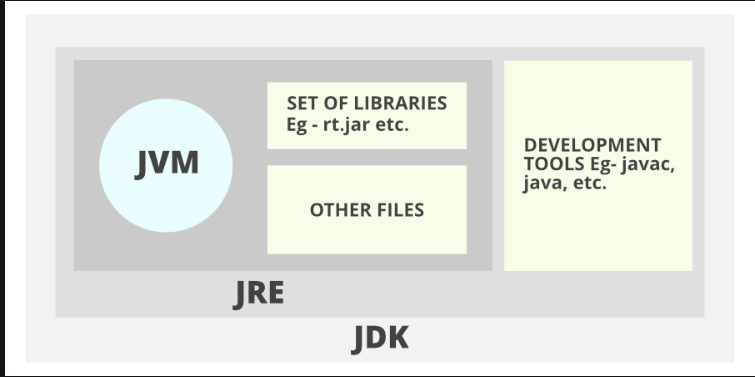

# java (a-z series)
it have cover all  topics  of java Journey 

##  OOPS

Object-Oriented Programming (OOP) is a way of writing computer programs that uses **objects** to organize data and actions. Think of it like a builder who uses pre-made bricks, windows, and doors (the "objects") to construct a house, rather than starting from scratch with raw materials.

### 👍 Key Concepts for a OOPS

* `Encapsulation`: This means bundling data and the functions that work on that data into a single unit. It's like putting all the controls for a TV into one remote; you don't need to know how the inside of the TV works to use it.

* `Inheritance` : This allows a new "child" class to get features from an existing "parent" class. For example, a "Dog" class can **inherit** from a "Mammal" class, automatically getting features like having a backbone without having to be reprogrammed.

* `Abstraction` : This is about hiding the complex details and showing only what is necessary. When you drive a car, you use the steering wheel and pedals without needing to know how the engine works. That's abstraction at play.

* `Polymorphism` : This means "many forms." It allows a single action to be done in different ways.

    For example, a `draw()` method could draw a circle, a square, or a triangle depending on the object it's being used on.

By using these concepts, programmers can create code that is more organized, easier to reuse, and simpler to fix.

## 🛠️  Why java is a platform independent language

Java is a platform-independent language because of its "write once, run anywhere" philosophy, which is made possible by the **Java Virtual Machine (JVM)** and **bytecode**.

### ⭐ The Two-Step Process

Most programming languages compile their code directly into machine code, which is specific to a particular operating system and processor. Java, however, uses a two-step process:

1.  `Compilation to Bytecode`: When you write and compile a Java program, the Java compiler (`javac`) doesn't create platform-specific machine code. Instead, it generates a universal, platform-neutral intermediate code called **bytecode**. This bytecode (`.class` file) is the same no matter what operating system you used to write the code.

2.  `Execution via JVM` : To run the bytecode, you need a **Java Virtual Machine (JVM)**. The JVM is a software layer that acts as an interpreter. It takes the platform-independent bytecode and translates it into the specific machine code for the operating system it's running on (e.g., Windows, macOS, or Linux).
---

### The Role of the JVM

The JVM is the key component that enables platform independence. While the Java program's bytecode is universal, the **JVM itself is platform-dependent**. There's a specific version of the JVM for each operating system. This means you can take the same compiled Java `.class` file and run it on a Windows machine with the Windows JVM, or on a Linux machine with the Linux JVM, without any changes to the code.

## Java Runtime Environment (JRE)

The JRE is what you need if you just want to run a Java application. It's the "engine" that enables a compiled Java program to run on your computer.

`Components`: The JRE includes the Java Virtual Machine (JVM), which executes the Java bytecode, and the core class libraries, which are pre-written code for common tasks like handling strings, files, and network connections.

`Purpose`: It's designed for end-users who need to use Java applications but don't need to write or compile code.

JRE and JDK are two different but related packages in the Java ecosystem. The main difference is that the JRE is for running Java programs, while the JDK is for developing them. The JDK is a superset of the JRE; it contains everything in the JRE, plus additional tools for developers.

## Java Development Kit (JDK)

The JDK is a complete package for Java developers. It contains everything needed to write, compile, debug, and run Java programs.

`Components`: The JDK includes the JRE (meaning it contains the JVM and class libraries) plus essential development tools, such as the Java compiler (javac), a debugger, and other utilities.

`Purpose`: It's designed for programmers who need to create new Java applications. You can't write a program without the JDK's compiler to convert your source code into bytecode.

