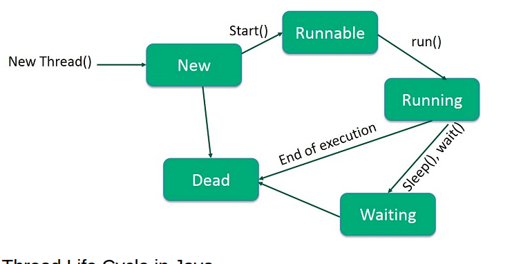

Threading in Java allows **multiple parts of a program to run simultaneously**, improving performance, responsiveness, and efficiency.

Below is a clear explanation with examples.

---

# 🚀 **What is Threading in Java?**

A **thread** is a lightweight subprocess; it's the smallest unit of a program that can run independently.

Java supports **multithreading**, meaning multiple threads can run at the same time.

---

# 🎯 **Why Use Threads?**

✔ Perform multiple tasks at the same time

✔ Faster execution

✔ Used in games, networking, animations, servers

✔ Keeps UI responsive

---

# 🧠 **Ways to Create a Thread**

Java provides **two main ways** to create threads:

---

# ✅ **1. Extending the Thread class**

```java
class MyThread extends Thread {
    public void run() {
        System.out.println("Thread is running...");
    }
}

public class Main {
    public static void main(String[] args) {
        MyThread t = new MyThread();
        t.start();  // start() internally calls run()
    }
}
```

---

# ✅ **2. Implementing Runnable interface**

```java
class MyTask implements Runnable {
    public void run() {
        System.out.println("Thread is running (Runnable)...");
    }
}

public class Main {
    public static void main(String[] args) {
        Thread t = new Thread(new MyTask());
        t.start();
    }
}
```

---

# 🌀 **Thread Lifecycle**

A thread goes through the following phases:

1. **New** – Thread created
2. **Runnable** – Ready to run
3. **Running** – Executing
4. **Blocked/Waiting** – Waiting for a resource
5. **Terminated** – Finished execution


---

# 🧵 **Common Thread Methods**

| Method      | Description                        |
| ----------- | ---------------------------------- |
| `start()`   | Starts the thread                  |
| `run()`     | Code executed by the thread        |
| `sleep(ms)` | Pauses thread                      |
| `join()`    | Waits for another thread to finish |
| `isAlive()` | Checks if thread is alive          |

---

# ✨ Example: Thread with Sleep

```java
class DemoThread extends Thread {
    public void run() {
        for (int i = 1; i <= 5; i++) {
            System.out.println("Thread Running: " + i);
            try {
                Thread.sleep(1000); // sleep for 1 sec
            } catch (InterruptedException e) {
                System.out.println(e);
            }
        }
    }
}

public class Main {
    public static void main(String[] args) {
        DemoThread t = new DemoThread();
        t.start();
    }
}
```

---

# ✨ Example: Multiple Threads Running Together

```java
class A extends Thread {
    public void run() {
        for (int i = 1; i <= 5; i++) {
            System.out.println("Thread A: " + i);
        }
    }
}

class B extends Thread {
    public void run() {
        for (int i = 1; i <= 5; i++) {
            System.out.println("Thread B: " + i);
        }
    }
}

public class Main {
    public static void main(String[] args) {
        A a = new A();
        B b = new B();

        a.start();
        b.start();
    }
}
```

→ Both threads execute **independently** and output may mix.

---

# 🔥 Using `join()` (Wait until thread finishes)

```java
class MyThread extends Thread {
    public void run() {
        for (int i = 1; i <= 5; i++) {
            System.out.println("Child Thread: " + i);
        }
    }
}

public class Main {
    public static void main(String[] args) throws Exception {
        MyThread t = new MyThread();
        t.start();
        t.join(); // main thread waits for t
        
        System.out.println("Main thread finished after child thread");
    }
}
```

---

# 🔒 Synchronization (Avoiding Thread Conflicts)

Used when multiple threads access the **same resource**.

```java
class Counter {
    int count = 0;

    synchronized void increment() {
        count++;
    }
}

public class Main {
    public static void main(String[] args) throws Exception {
        Counter obj = new Counter();

        Thread t1 = new Thread(() -> {
            for (int i = 0; i < 1000; i++)
                obj.increment();
        });

        Thread t2 = new Thread(() -> {
            for (int i = 0; i < 1000; i++)
                obj.increment();
        });

        t1.start();
        t2.start();

        t1.join();
        t2.join();

        System.out.println("Final Count: " + obj.count);
    }
}
```

Without `synchronized`, output will be incorrect.

---

# 🌟 Summary

✔ **Thread** = smallest unit of execution
✔ Create thread by **extending Thread** or **implementing Runnable**
✔ `start()` begins thread
✔ Many helpful methods: `sleep()`, `join()`, `isAlive()`
✔ Synchronization prevents conflicts in shared data

---

